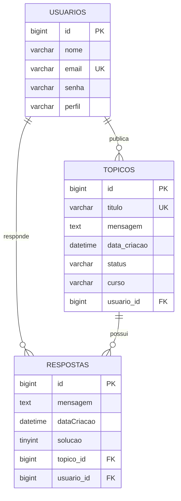

# 💬 ForumHub API — Fórum de Discussões


---

## 🔗 Acesso e Documentação Interativa

* **Ambiente de Desenvolvimento:** `http://localhost:8080`
* **Documentação Swagger UI:** [http://localhost:8080/swagger-ui.html](http://localhost:8080/swagger-ui.html)
* **OpenAPI Specs (JSON):** `http://localhost:8080/v3/api-docs`

---

## 📖 Visão Geral

O **ForumHub** é uma API REST desenvolvida em **Java 21** e **Spring Boot 3.4.0**, projetada para reproduzir a camada de persistência e regras de negócio de um fórum de dúvidas e discussões entre alunos e instrutores. 

O projeto foi concebido como solução para o desafio de back-end do programa **ONE (Oracle Next Education)** em parceria com a **Alura**. A plataforma permite autenticação de usuários via tokens JWT, controle de perfis de acesso, criação, consulta paginada, detalhamento com respostas, atualização e exclusão de tópicos, aplicando validações estritas de unicidade e regras de integridade relacional.

---

## ✨ Funcionalidades

* 🔐 **Autenticação Segura:** Login de usuários com verificação de credenciais criptografadas via BCrypt e emissão de tokens JWT com expiração temporal configurável.
* 📝 **Gestão de Tópicos (CRUD Completo):**
  * Criação de novos tópicos vinculados automaticamente ao usuário autenticado.
  * Validação de unicidade para prevenir duplicidade de títulos e mensagens idênticas.
  * Listagem paginada e ordenada cronologicamente com suporte a filtros dinâmicos.
  * Consulta detalhada de um tópico trazendo metadados do autor e lista de respostas associadas.
  * Atualização idempotente de título, mensagem e curso.
  * Remoção lógica e integridade referencial com respostas cadastradas.
* 🛡️ **Filtro de Segurança Interceptador:** Validação automática de cabeçalhos `Authorization: Bearer <token>` em todas as rotas protegidas.
* 📑 **Versionamento do Banco:** Migrações estruturadas via Flyway gerenciando tabelas de usuários, tópicos e respostas.
* 🚦 **Padronização de Erros HTTP:** Tratamento global de exceções retornando mensagens padronizadas em JSON para erros 400, 401, 403, 404 e 500.

---

## 🎯 Diferenciais e Destaques Técnicos

1. **Arquitetura Stateless com Spring Security & Auth0 JWT:** A API não mantém estado de sessão em servidor (`SessionCreationPolicy.STATELESS`), delegando a autenticidade e autorização exclusivamente à assinatura criptográfica HMAC256 do token JWT.
2. **Defesa contra Tópicos Duplicados:** Camada de serviço/controlador com verificação prévia no banco via `existsByTituloOrMensagem(...)`, impedindo cadastros redundantes.
3. **Controle Declarativo de Paginação:** Uso de anotações `@PageableDefault` do Spring Data para otimização de consultas e redução de payload em tráfego.
4. **Tratamento Global com `@RestControllerAdvice`:** Captura e mapeamento granular de falhas como `MethodArgumentNotValidException`, `EntityNotFoundException` e `JWTVerificationException`.

---

## 🏗️ Arquitetura e Estrutura de Pastas

A aplicação segue uma arquitetura orientada a domínios (Domain-Driven Package Layout) sob as convenções do Spring Framework:

```text
src/
├── main/
│   ├── java/dev/erickystn/forumhub/
│   │   ├── ForumhubApplication.java        # Classe de inicialização Spring Boot
│   │   ├── controller/                     # Controladores REST expostos
│   │   │   ├── AutenticacaoController.java # Endpoint de login e geração de JWT
│   │   │   └── TopicoController.java       # Operações CRUD da entidade Tópico
│   │   ├── domain/                         # Camada de negócio e persistência
│   │   │   ├── resposta/                   # Entidade Resposta e DTO de detalhamento
│   │   │   ├── topico/                     # Entidade Tópico, DTOs (Cadastro, Detalhamento, Listagem), Enum Status e Repository
│   │   │   └── usuario/                    # Entidade Usuario, UserDetails, DTOs e AutenticacaoService
│   │   └── infra/                          # Configurações de infraestrutura
│   │       ├── exception/                  # TratadorDeErros (@RestControllerAdvice)
│   │       └── security/                   # SecurityConfiguration, SecurityFilter, TokenService e SpringDocConfiguration
│   └── resources/
│       ├── application.properties          # Configurações de DataSource, JPA, JWT e paginação
│       └── db/migration/                   # Scripts SQL versionados pelo Flyway (V1, V2, V3)
└── test/
    └── java/dev/erickystn/forumhub/        # Testes de contexto Spring Boot
```

---

## 🎲 Modelagem do Banco de Dados (DER)

A estrutura relacional foi desenhada para garantir integridade referencial e histórico de discussões:



---

## 🛡️ Arquitetura de Segurança e Autenticação

A segurança é gerenciada pelo `SecurityConfiguration` e pelo filtro customizado `SecurityFilter`:

* **Criptografia:** Senhas armazenadas com algoritmo de hash unidirecional **BCrypt** (`BCryptPasswordEncoder`).
* **Tokens JWT:** Assinados com algoritmo **HMAC256**, utilizando o segredo configurado na propriedade `api.security.token.secret` e validade padrão de 2 horas.
* **Fluxo de Autorização:**
  1. O cliente envia requisição `POST /login` com credenciais válidas.
  2. O `AuthenticationManager` valida o hash da senha no banco.
  3. O `TokenService` gera um JWT assinado contendo o e-mail do usuário como *Subject*.
  4. Nas requisições subsequentes, o cliente anexa o token no cabeçalho `Authorization: Bearer <token>`.
  5. O `SecurityFilter` intercepta a requisição antes do `UsernamePasswordAuthenticationFilter`, valida a assinatura/expiração e injeta a autenticação no `SecurityContextHolder`.

---

## 📋 Tabela de Endpoints

| Método | Rota | Autenticação | Descrição |
| :--- | :--- | :--- | :--- |
| `POST` | `/login` | Pública | Autentica o usuário e retorna o token JWT |
| `POST` | `/topicos` | Requerida (`Bearer`) | Cria um novo tópico associado ao usuário logado |
| `GET` | `/topicos` | Requerida (`Bearer`) | Retorna lista paginada de tópicos (`size=10, sort=dataCriacao,asc`) |
| `GET` | `/topicos/{id}` | Requerida (`Bearer`) | Detalha um tópico específico e suas respectivas respostas |
| `PUT` | `/topicos/{id}` | Requerida (`Bearer`) | Atualiza o título, mensagem e curso do tópico informado |
| `DELETE` | `/topicos/{id}` | Requerida (`Bearer`) | Remove o tópico e seus vínculos relacionais |

---

## 📋 Validações e Regras de Negócio

* **Campos Obrigatórios:** `titulo`, `mensagem` e `curso` validados com `@NotBlank` no DTO `DadosCadastroTopico`.
* **Regra de Unicidade:** Tópicos não podem ter título ou mensagem idênticos a registros já existentes.
* **Normalização de Dados:** Aplicação de `.trim()` em textos e conversão de cursos para caixa alta (`.toUpperCase()`).
* **Estado Inicial:** Novos tópicos recebem automaticamente o status `NAO_SOLUCIONADO`.
* **Exclusão de Registros:** Respostas filhas possuem restrição e integridade referencial vinculadas ao tópico pai.

---

## 🎯 Padrões de Projeto e Práticas Implementadas

* **Data Transfer Objects (DTOs com Java Records):** Imutabilidade e transporte seguro de dados desacoplando entidades JPA de requisições e respostas HTTP (`DadosCadastroTopico`, `DadosDetalhamentoTopico`, `DadosTokenJWT`).
* **Injeção de Dependências & Inversão de Controle (IoC):** Gerenciamento completo de componentes e serviços pelo contêiner do Spring.
* **Repository Pattern:** Interface `TopicoRepository` e `UsuarioRepository` estendendo `JpaRepository` para abstração de persistência SQL.
* **Intercepting Filter Pattern:** `SecurityFilter` herdando de `OncePerRequestFilter` para validação centralizada de tokens por requisição.
* **Global Exception Handler:** Centralização de captura de falhas com `@RestControllerAdvice` em `TratadorDeErros`.

---

## ⚙️ Requisitos e Instalação

### Pré-requisitos
* **Java Development Kit (JDK):** Versão 21 ou superior.
* **Apache Maven:** Versão 3.9+ (ou utilizar o wrapper `./mvnw` incluso).
* **Banco de Dados MySQL:** Versão 8.0+.
* **Git:** Para clonagem e versionamento.

### 1. Clonar o Repositório
```bash
git clone https://github.com/erickystn/Forum-Hub.git
cd Forum-Hub
```

### 2. Configurar o Banco de Dados e Variáveis
Crie o banco de dados no seu servidor MySQL:
```sql
CREATE DATABASE forumhub_api;
```

Edite o arquivo `src/main/resources/application.properties` ou forneça as variáveis de ambiente necessárias:
```properties
spring.datasource.url=jdbc:mysql://localhost:3306/forumhub_api
spring.datasource.username=seu_usuario_mysql
spring.datasource.password=sua_senha_mysql
api.security.token.secret=${API_SECRET:sua_chave_secreta_jwt}
```

---

## 🚀 Como Executar

Execute o projeto através do Maven Wrapper:

```bash
# Linux/macOS
./mvnw spring-boot:run

# Windows
mvnw.cmd spring-boot:run
```

O servidor iniciará por padrão em `http://localhost:8080`. O Flyway executará as migrações SQL automaticamente na inicialização da aplicação.

---

## 💻 Exemplos de Uso e Requisições

### 1. Autenticação (`POST /login`)
```bash
curl -X POST http://localhost:8080/login \
  -H "Content-Type: application/json" \
  -d '{
    "email": "usuario@email.com",
    "senha": "123456"
  }'
```

**Resposta (200 OK):**
```json
{
  "token": "eyJhbGciOiJIUzI1NiIsInR5cCI6IkpXVCJ9...",
  "tipo": "bearer"
}
```

---

### 2. Cadastro de Tópico (`POST /topicos`)
```bash
curl -X POST http://localhost:8080/topicos \
  -H "Content-Type: application/json" \
  -H "Authorization: Bearer <SEU_TOKEN_JWT>" \
  -d '{
    "titulo": "Dúvida sobre Spring Security",
    "mensagem": "Como configurar autenticação stateless?",
    "curso": "SPRING BOOT 3"
  }'
```

**Resposta (201 Created):**
```json
{
  "id": 1,
  "titulo": "Dúvida sobre Spring Security",
  "mensagem": "Como configurar autenticação stateless?",
  "dataCriacao": "2026-09-02T12:00:00",
  "nomeAutor": "Ericky Santana",
  "respostas": []
}
```

---

### 3. Listagem Paginada (`GET /topicos`)
```bash
curl -X GET "http://localhost:8080/topicos?page=0&size=10&sort=dataCriacao,desc" \
  -H "Authorization: Bearer <SEU_TOKEN_JWT>"
```

---

## 🧪 Suíte de Testes

Para executar os testes unitários e de contexto da aplicação:

```bash
# Execução dos testes via Maven
./mvnw test
```

---

## 🛠️ Tecnologias Utilizadas

| Tecnologia | Versão | Finalidade |
| :--- | :--- | :--- |
| **Java** | 21 | Linguagem de programação principal |
| **Spring Boot** | 3.4.0 | Framework corporativo base da aplicação |
| **Spring Security** | 6.x | Autenticação, autorização e controle de acessos stateless |
| **Auth0 Java JWT** | 4.4.0 | Geração, validação e assinatura de tokens JWT |
| **Spring Data JPA** | 3.x | Abstração de persistência e repositórios relacionais |
| **Hibernate** | 6.x | Mecanismo de Mapeamento Objeto-Relacional (ORM) |
| **Flyway Migration** | 10.x | Versionamento determinístico e evolução do esquema SQL |
| **MySQL Connector** | 8.x | Driver JDBC para conexão com o banco de dados |
| **Lombok** | — | Redução de boilerplate em modelos e entidades |
| **SpringDoc OpenAPI**| 2.7.0 | Geração automática de documentação Swagger |

---

## 📈 Melhorias e Próximos Passos (Roadmap)

- [ ] Implementação de endpoints completos para criação e moderação de Respostas (`/respostas`).
- [ ] Marcação de resposta como solução oficial do tópico (`solucao: true`).
- [ ] Cadastro público de novos usuários com ativação via confirmação de e-mail.
- [ ] Suporte a filtros dinâmicos por nome de curso e ano de criação na listagem de tópicos.
- [ ] Configuração de perfil de testes com banco em memória H2.
- [ ] Criação de containerização com `Dockerfile` e `docker-compose.yml`.

---

## 🤝 Como Contribuir

1. Faça um **Fork** do projeto.
2. Crie uma branch para sua funcionalidade:
   ```bash
   git checkout -b feature/nova-funcionalidade
   ```
3. Realize o commit de suas alterações com mensagens claras:
   ```bash
   git commit -m 'feat: adiciona endpoint de resposta ao topico'
   ```
4. Envie as alterações para o seu repositório remoto:
   ```bash
   git push origin feature/nova-funcionalidade
   ```
5. Abra um **Pull Request** detalhado para revisão.

---

## 👤 Autor & 📄 Licença

Desenvolvido por **[Ericky Santana](https://github.com/erickystn)** no âmbito do desafio Alura ONE.

Este projeto está sob os termos de licença padrão do repositório.
